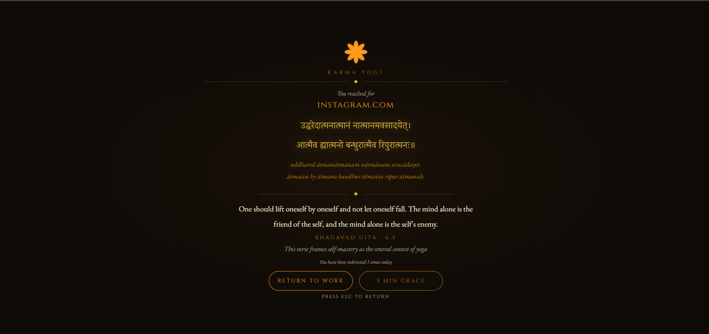
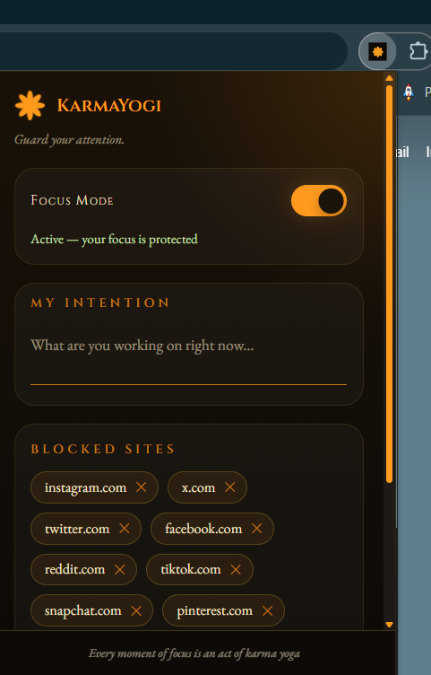

# 🪷 KarmaYogi

> *"You have a right to perform your duties, but not to the fruits of your actions."*
> — Bhagavad Gita, 2.47

**KarmaYogi** is a Chrome extension that blocks distracting websites and replaces them with a moment of stillness — a Bhagavad Gita verse, your stated intention, and a soft temple bell. Not punishment. A pause.

---

## ✨ Features

- 🚫 **Site Blocking** — redirect any site you choose the moment you navigate to it
- 📿 **Gita Verse Page** — each redirect shows a random Sanskrit shloka with transliteration, translation, and context
- 🎯 **Focus Intention** — set what you're working on; it appears on every blocked page
- ⏳ **5-Minute Grace Period** — genuinely need a site? Take 5 minutes, then blocking resumes
- 🔔 **Temple Bell** — a single soft synthesized ghanti strike on every redirect (Web Audio API)
- 📊 **Daily Redirect Count** — see how many times you've been redirected today
- 🧘 **Focus Mode Toggle** — pause all blocking from the popup
- 🥷 **Incognito Support** — works in incognito with one manual step

---

## 📸 Preview

**The blocked page** — a Sanskrit shloka, your intention, and a way back to work:



**The popup** — focus mode, intention, and blocklist management:



---

## 🚀 Installation

Not yet on the Chrome Web Store — load it manually in under a minute:

1. **Download**
   ```bash
   git clone https://github.com/swarn6402/karmayogi.git
   ```
2. Open `chrome://extensions` and enable **Developer Mode** (top-right toggle)
3. Click **Load unpacked** → select the `karmayogi` folder

The lotus icon appears in your toolbar. You're done. 🪷

**Incognito:** `chrome://extensions` → KarmaYogi → **Details** → enable **Allow in Incognito**.

---

## 🛠 Usage

| Action | How |
|---|---|
| **Block a site** | Click the toolbar icon, type a domain (e.g. `reddit.com`), press Enter |
| **Unblock a site** | Click the **✕** on its pill in the popup |
| **Set your intention** | Type it in the popup's **"My Intention"** field |
| **Pause all blocking** | Toggle **Focus Mode** off in the popup |
| **Grace period** | Click **"5 Min Grace"** on the blocked page |

---

## 🕉 Adding More Gita Quotes

Open `quotes.js` and add an object to the `GITA_QUOTES` array:

```javascript
{
  verse: "6.35",
  sanskrit: "असंशयं महाबाहो मनो दुर्निग्रहं चलम्। ...",
  transliteration: "asaṃśayaṃ mahābāho mano durnigrahaṃ calam, ...",
  translation: "The mind is restless and difficult to control — but it can be tamed by practice and detachment.",
  context: "Krishna's two-word answer to the restless mind: practice and detachment"
}
```

Then reload the extension at `chrome://extensions`.

---

## 🎨 Design

A **Sacred Minimalism** aesthetic — deep charcoal, saffron `#FF9A1F`, antique gold `#D4AF37`; Noto Serif Devanagari, Cinzel, and EB Garamond typography; a subtle mandala background and diya-flame glow. The goal: not a blocker that punishes, but a threshold that pauses.

---

## 🧰 Tech Stack

- **Manifest V3** — pure HTML, CSS, and vanilla JavaScript; no frameworks, no dependencies
- `chrome.webNavigation` — main-frame navigation interception
- `chrome.storage.sync` — blocklist, focus mode, intention (synced across devices)
- `chrome.storage.local` — daily redirect count, grace period timestamps
- **Web Audio API** — synthesized temple bell, no audio files

---

## 🤝 Contributing

Pull requests welcome — fork, branch, and open a PR. Adding verified Gita verses is especially appreciated. Please keep the design language consistent: sacred, minimal, warm.

## 📜 License

[MIT](LICENSE)

---

🙏 *Built by [Swarnjeet](https://github.com/swarn6402). Every moment of focus is an act of karma yoga.*
